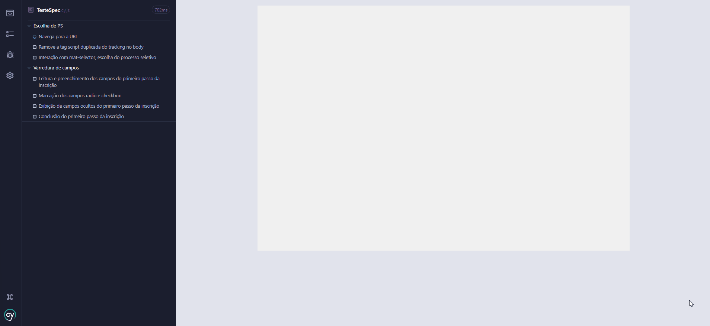

# Cypress AutoSign Project

Cypress AutoSign é um projeto desenvolvido para automação de testes na ficha de inscrições e matrículas integrada ao RM TOTVS da Rubeus. Ele é capaz de gerar dados aleatórios e padronizados, permitindo realizar inscrições em qualquer ficha integrada Rubeus, independentemente dos campos configurados.

Sua principal intenção é rodar testes para validar a funcionalidade e estabilidade do produto, garantindo sua qualidade antes da execução de testes manuais.

<br>

## 🎯Funcionalidades
> 1. Geração automática de dados aleatórios de candidatos <br>
> 2. Possíbilidade de personalização desses dados, gerando candidatos maiores ou menores de idade, de ambos os sexos, de diferentes nacionalidades, com ou sem deficiência <br>
> 3. Suporte para diferentes formatos e configurações de fichas <br>
> 4. Execução de testes end-to-end em ambientes integrados ao RM TOTVS. <br>
> 5. Relatórios automáticos de execução dos testes. <br>
> 6. Possibilidade de rodar e parametrizar os testes via terminal.

<br>

## 🖥️ Demonstração


<br>

## 🛠️ Configuração e Uso
1. Clone o repositório:
```bash
git clone https://github.com/ricardobelinato/cypress_autosign
```

2. Instale as dependências do projeto:
```bash
npm install
```

3. Renomeie o arquivo configSpecExample.js, localizado na pasta cypress/config/, removendo o sufixo Example do nome para transformá-lo em configSpec.js. Em seguida, configure o arquivo preenchendo as variáveis necessárias conforme o exemplo abaixo:
```js
function CONFIG() {
    return {
        url: "",            // URL da ficha de inscrição
        ps: 0,              // Código do processo seletivo
    };
}

function CANDIDATO(){
    return {
        sexo: "M",          //'M' para masculino ou 'F' para feminino 
        nacionalidade: "0", //'0' para brasileiro ou '1' para estrangeiro
        maioridade: true,
        deficiencia: false,
    }
}
```

4. Execute os testes com Cypress:
```
npx cypress open
```

5. Escolha o teste que deseja rodar no painel do Cypress

<br>

## 📂 Estrutura do Projeto
<pre>
    cypress/
      ├── config/                                       # Configurações internas, incluindo parâmetros da ficha e geração de candidatos fictícios
      ├── e2e/                                          # Testes end-to-end. Arquivo principal executável individual por ficha
      └── support/                                      # Scripts de suporte e lógica principal
            ├── formSteps/                              # Scripts específicos para cada passo da ficha de inscrição
                  ├── 01_EscolhaDePS.cy.js              # Script para a escolha do processo seletivo.
                  ├── 02_VarreduraCampos.cy.js          # Script para leitura e preenchimento dinâmico dos campos.
                  └── 03_EscolhaDeCurso.cy.js           # Script para a escolha de oferta, modalidade e local de oferta.
            └── dataGenerator.js                        # Script com funções para geração de dados fictícios
    cypress.config.js                                   # Configurações globais do Cypress
    run-tests.mjs                                       # Script pra rodar os testes via terminal por inquirer
</pre>
